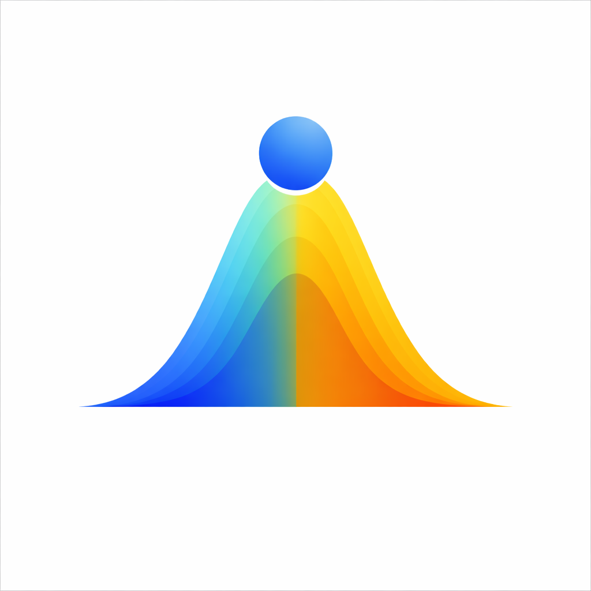
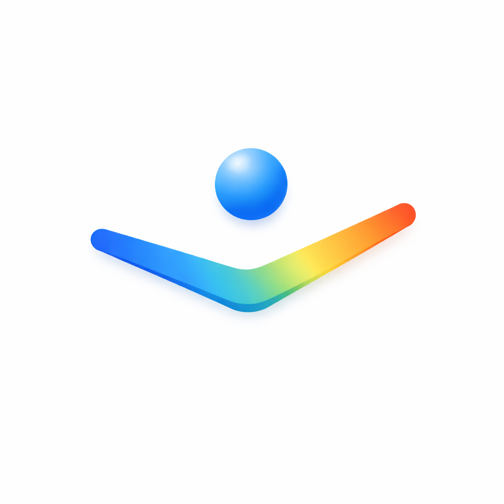

# SEKI

**iOS Developer · Product Systems · Performance-Focused Software**

---

I build focused iOS applications for real-world situations where clarity, usability, and reliability matter. The work is grounded in intentional interaction design — removing friction where it counts, structuring information cleanly, and building systems that hold up when conditions aren't ideal.

---

## Apps

 

<table>
<tr>
<td width="64" valign="top">

</td>
<td valign="top">

### VorilaPrep

A pre-performance regulation system for competitions, presentations, exams, and high-pressure situations.

Designed for fast interaction and minimal cognitive overhead. Sessions are short, structured, and usable under real pressure — not ideal conditions.

- Offline-first, no network dependencies
- Structured preparation workflows
- Built from real competitive experience
- Standalone Apple Watch app in development

**Swift · SwiftUI · HealthKit · watchOS · Localization**

[App Store](https://apps.apple.com/de/app/vorila-prep/id6760753050) · [Website](https://sebastian-kerski.github.io/vorila/)

</td>
</tr>
</table>

 

<table>
<tr>
<td width="64" valign="top">

</td>
<td valign="top">

### VorilaLog

A lightweight manual activity logger for situations where wearables are limited or not usable — martial arts, competitions, contact sports, constrained environments.

Complements Apple Health and Activity Rings with meaningful, accurate logging rather than sensor approximation.

**Swift · SwiftUI · HealthKit · Localization**

[App Store](https://apps.apple.com/de/app/vorilalog/id6758885506)

</td>
</tr>
</table>

 

<table>
<tr>
<td width="64" valign="top">

</td>
<td valign="top">

### Spichr

A pantry and household inventory app built around simplicity, structure, and long-term maintainability. Actively developed.

- CloudKit-based collaboration and shared household inventory
- Offline-first architecture
- Calm, low-friction interaction design

**Swift · SwiftUI · CoreData · CloudKit · Localization**

[App Store](https://apps.apple.com/de/app/spichr/id6749096170) · [Repository](https://github.com/Sebastian-Kerski/Spichr)

</td>
</tr>
</table>

---

## Approach

Purposeful software — every decision has a reason. I focus on reliability over novelty, structured systems over surface complexity, and usability under real-world constraints. Accessibility and calm interaction are built into the process, not added afterwards.

---

## Background

Competitive judo athlete. Experience with process development and optimization in regulated environments. Background in systems thinking, human performance, and the gap between designed experience and real-world use.

---

## Tech

Swift · SwiftUI · iOS · watchOS · HealthKit · CloudKit · CoreData · Localization · Apple HIG

---

## Contact

sekidev@icloud.com
